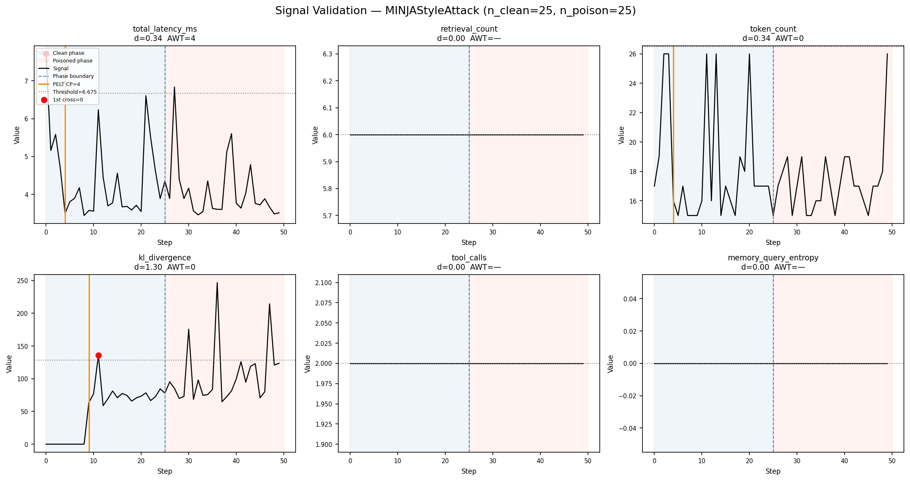

# ChronoAgent

> Temporal behavioral monitoring and health-weighted task allocation for multi-agent LLM systems under memory-poisoning attacks.

[](https://github.com/rajo69/chronoagent/actions/workflows/ci.yml)
[](https://github.com/rajo69/chronoagent/actions/workflows/release.yml)


---

## Abstract

Multi-agent LLM systems that share a persistent vector memory are increasingly deployed for complex tasks such as code review, financial analysis, and healthcare triage. A growing body of work demonstrates that these shared memories are vulnerable to poisoning attacks: a single adversary who can write to the knowledge base can redirect the behavior of every downstream agent that retrieves from it (AGENTPOISON \[1\], MINJA \[2\], A-MemGuard \[3\]).

Existing defenses operate reactively. They inspect individual retrievals or agent outputs after poisoning has already taken effect. None of them treat the agent's observable behavior as a time series, and none ask the question: *has this agent's behavior changed in a way that predicts it is about to produce corrupted output?*

ChronoAgent is a runtime monitoring layer that answers this question. It collects six behavioral signals per agent per step (latency, retrieval count, token count, KL divergence from a clean embedding baseline, tool-call frequency, and memory-query entropy), feeds them into an ensemble of Bayesian Online Changepoint Detection (BOCPD) \[5\] and the Chronos-2-Small pretrained time-series forecaster \[6\], and produces a per-agent **health score** in \[0, 1\] that updates in real time. Two downstream subsystems consume this score: a **health-weighted contract-net task allocator** that routes work away from drifting agents, and a **human escalation layer** that pages a reviewer when no available agent is trustworthy.

The system is evaluated against MINJA and AGENTPOISON attacks across six configurations (two attack types, three ablations, one reactive baseline), measuring advance warning time (AWT), allocation efficiency, and ROC characteristics. KL divergence is confirmed as a strong, attack-agnostic detection signal (Cohen's d > 1.3). The full evaluation protocol, all experiment configs, and a single `make reproduce` target are included in this repository.

---

## Motivation and Research Gap

### The Problem

Multi-agent LLM systems (built on frameworks like LangChain \[14\], LangGraph \[15\], AutoGen \[9\], MetaGPT \[10\]) delegate complex tasks to specialized agents that share a persistent vector memory (typically ChromaDB \[16\] or similar). This architecture enables long-horizon reasoning and knowledge accumulation, but it introduces a single point of vulnerability: the shared memory layer. A single poisoned document, crafted to sit near legitimate retrieval queries in embedding space, can influence every agent that retrieves from the store.

### What Exists Today

**Memory poisoning attacks** are well-documented. AGENTPOISON \[1\] demonstrated red-teaming via knowledge-base poisoning at NeurIPS 2024. MINJA \[2\] achieves >95% attack success through query-optimized memory injection. The LiU framework \[4\] tested attacks on electronic health records (MIMIC-III) and explicitly identified "adaptive trust calibration" as an open problem. A-MemGuard \[3\] proposes dual-memory consensus verification as a defense, achieving 95% reduction in poisoning success. All of these defenses are **reactive**: they detect or sanitize after injection has occurred.

**Anomaly detection in multi-agent systems** also exists. Existing runtime monitors such as NeMo Guardrails \[11\], Llama Guard \[12\], and Constitutional AI \[13\] focus on content-level filtering (asking "is this message safe?"). Trace-level approaches like SentinelAgent model execution graphs with LLM oversight, and TraceAegis achieves 94.3% accuracy via hierarchical trace analysis. All of these are **reactive**: they analyze past traces or individual outputs rather than forecasting future agent behavior.

**Time-series forecasting with LLMs** is a maturing field. Chronos-2 \[6\] provides a pretrained probabilistic forecaster. Time-LLM patches time-series into frozen language models. DCATS uses LLM agents for data-centric AutoML. All of these use temporal models to forecast **external** time-series (demand, weather, stock prices). None apply temporal models to forecast **the agents themselves**.

**Decentralized task allocation** in multi-agent reinforcement learning (LGTC-IPPO, Dec-POMDP \[8\]) treats agents as reliable actors. The contract-net protocol \[7\] allocates tasks via bidding based on capability. No published framework adjusts allocation based on **predicted future agent reliability**.

### The Gap

No published work (as of April 2026) uses time-series forecasting of agent behavioral metrics to simultaneously inform task allocation and security monitoring. The four communities above have not bridged this intersection. ChronoAgent is a systems-integration contribution that fills this gap using off-the-shelf components in a combination that has not been published.

---

## Contributions

1. **Six-signal behavioral profile** per agent per step (latency, retrieval count, token count, KL divergence, tool-call frequency, memory-query entropy), with empirical validation that KL divergence is a strong, attack-agnostic detection signal (Cohen's d > 1.3 under both MINJA and AGENTPOISON).

2. **BOCPD + Chronos-2 ensemble** for real-time changepoint detection on behavioral signals, with graceful degradation to BOCPD-only when the forecaster is unavailable.

3. **Health-weighted contract-net task allocator** that modulates agent bids by predicted reliability, routing work away from drifting agents and escalating to a human reviewer when no agent is trustworthy.

4. **End-to-end evaluation framework** with six experiment configurations, three ablations, one reactive baseline, and a single `make reproduce` command that regenerates all results, figures, and LaTeX tables.

The contribution boundary is deliberately narrow: ChronoAgent does not invent new forecasting models, new attacks, or new MARL algorithms. It uses existing tools in a particular combination, and the novelty lies in the integration and the evaluation.

---

## Formal Problem Statement

We formalize ChronoAgent as a Partially Observable Markov Decision Process (POMDP) defined by the tuple $\langle S, A, \Omega, T, O, R, \gamma \rangle$. The allocator is centralized: it observes the full signal vector across all agents and issues allocation decisions. This is weaker than a Dec-POMDP, which we discuss at the end of the section.

### State Space $S$

The true state at step $t$ is a tuple $s_t = (M_t, \boldsymbol{\theta}_t, q_t)$ where:

- $M_t \in \{0, 1, \ldots, K\}$ is the memory corruption level, i.e. the number of active poison documents in the retrieval corpus.
- $\boldsymbol{\theta}_t = (\theta_t^1, \ldots, \theta_t^n)$ is the vector of per-agent behavioral regimes, with $\theta_t^i \in \{\text{clean}, \text{drifting}\}$.
- $q_t$ is the pending task queue.

Critically, $M_t$ and each $\theta_t^i$ are hidden: they are never directly observed. This partial observability is what distinguishes the problem from a standard MDP and motivates belief-state monitoring.

### Action Space $A$

For each pending task the allocator selects $a_t \in \{1, \ldots, n\} \cup \{\text{escalate}\}$, corresponding to assigning task $j$ to agent $i$ or escalating the task to a human reviewer.

### Observation Space $\Omega$

At each step the allocator observes a six-signal behavioral profile per agent:

$$\omega_t^i = (\ell_t^i, \, r_t^i, \, \tau_t^i, \, D_{\mathrm{KL},t}^i, \, f_t^i, \, H_t^i) \in \mathbb{R}^6$$

corresponding to latency, retrieval count, token count, KL divergence (against a clean reference distribution), tool-call frequency, and memory-query entropy. The full observation concatenates across all $n$ agents: $\omega_t \in \mathbb{R}^{6n}$.

The Phase 1 empirical signal validation grounds the observation model. Under the MINJA attack:

$$D_{\mathrm{KL}} \mid \theta^i = \text{clean} \sim \mathcal{N}(42.21, 32.89^2), \quad D_{\mathrm{KL}} \mid \theta^i = \text{drifting} \sim \mathcal{N}(97.18, 47.61^2)$$

Under AGENTPOISON:

$$D_{\mathrm{KL}} \mid \theta^i = \text{clean} \sim \mathcal{N}(42.21, 32.89^2), \quad D_{\mathrm{KL}} \mid \theta^i = \text{drifting} \sim \mathcal{N}(89.03, 33.89^2)$$

The Phase 1 Cohen's $d$ values of $1.343$ (MINJA) and $1.402$ (AGENTPOISON) directly quantify the separation between these observation distributions. The clean distribution is identical across the two attack conditions because Phase 1 shares a single calibration phase (seed 42) before injection. Note that 3 of the 6 signals degenerate to zero variance under the MockBackend and are modeled as constants; this is a deliberate simplification of the observation model for deterministic experimentation.

### Transition Function $T$

The transition kernel $T(s_{t+1} \mid s_t, a_t)$ decomposes into three components:

- **Corruption dynamics.** $M_{t+1} = M_t + \xi_t$, where $\xi_t \sim \text{Poisson}(\lambda)$ models a stochastic attacker injecting poison documents at rate $\lambda$, or $\xi_t = k \cdot \mathbb{1}(t = t_{\text{inject}})$ models a burst injection of $k$ documents at time $t_{\text{inject}}$.
- **Regime transitions.** $P(\theta_{t+1}^i = \text{drifting} \mid \theta_t^i = \text{clean}, M_t) = g(M_t)$, with $g$ monotonically increasing in $M_t$: agents that retrieve from increasingly corrupted memory are more likely to drift into the compromised regime.
- **Task queue.** $q_t$ updates deterministically given allocation decisions and new task arrivals.

### Observation Function $O$

$O(\omega_t \mid s_t, a_t)$ is the probability of observing $\omega_t$ under true state $s_t$. We factor the observation model across agents under the assumption that per-agent signals are conditionally independent given each agent's regime:

$$O(\omega_t \mid s_t) = \prod_{i=1}^{n} P(\omega_t^i \mid \theta_t^i)$$

Each factor is parameterized by the clean and drifting distributions fit in Phase 1.

### Reward Function $R$

The reward decomposes into task and safety components:

$$R(s_t, a_t) = \alpha \cdot R_{\text{task}}(s_t, a_t) + \beta \cdot R_{\text{safety}}(s_t, a_t)$$

with:

- $R_{\text{task}}$ returning $+1$ for correct allocation to a clean agent, $-1$ for allocation to a compromised agent, and $-c_e$ for escalation (reflecting the cost of human intervention).
- $R_{\text{safety}}$ returning $+1$ for a true positive detection of a drifting agent and $-c_f$ for a false alarm.

In the empirical results, allocation efficiency approximates $\mathbb{E}[R_{\text{task}}]$ and the detection AUROC characterizes the discrimination quality of $R_{\text{safety}}$.

### Discount Factor $\gamma$

The discount factor controls the policy's temporal horizon. As $\gamma \to 0$ the policy becomes myopic, maximizing immediate throughput and ignoring health signals; as $\gamma \to 1$ the policy weights future corruption risk, favoring conservative allocation even at short-term throughput cost.

### Implementation Status of the State Space

The state-space elements $M_t$, $\boldsymbol{\theta}_t$, and $q_t$ are conceptual formalizations of the decision problem rather than explicit runtime variables in the code. The implementation tracks derived quantities: the per-agent health score acts as the belief over $\theta_t^i$, per-retrieval integrity flags replace a scalar $M_t$, and the allocator is stateless across tasks rather than maintaining a persisted $q_t$. The POMDP tuple is a faithful model of what the system is deciding and observing, not a one-to-one map of the code's data structures.

### Connection to System Components

Each module of ChronoAgent maps to a specific operation over the POMDP:

- **BOCPD as approximate Bayesian filtering.** The Bayesian Online Changepoint Detector maintains a posterior over run-length $r_t$ on the signal stream $x_{1:t}^i$. The changepoint probability $P(r_t = 0 \mid x_{1:t}^i)$ approximates the regime-transition posterior $P(\theta_t^i \neq \theta_{t-1}^i \mid \omega_{1:t}^i)$.
- **Health score as belief state.** The per-agent health score is the sufficient statistic for decision-making under partial observability. It compresses the observation history $\omega_{1:t}^i$ into a scalar summary of $P(\theta_t^i = \text{clean} \mid \omega_{1:t}^i)$.
- **Allocator policy over the belief space.** The contract-net allocator (threshold health, scale bids by health, escalate when no agent is trustworthy) is a hand-designed policy $\pi(b_t)$ operating on the belief $b_t$ rather than the hidden state $s_t$.
- **AWT = 0 is structural.** The observation function $O$ depends on the current state $s_t$ only, not on future states. Concurrent detection (alerting at or before the step at which drift begins) is therefore the theoretical best case achievable given this observation structure: no detector can systematically lead the regime change when the leading information is not encoded in the present observation.

### Limitations of the Centralized Formulation

The formulation above assumes a centralized allocator that observes the full signal vector $\omega_t \in \mathbb{R}^{6n}$ across all agents. In distributed deployments where agents run on separate infrastructure with communication constraints, each agent would observe only its own signals and the coordination problem becomes a Dec-POMDP, a strictly harder problem class requiring decentralized policies with partial information sharing. We leave the decentralized extension to future work.

---

## Quick Start

### With Docker

```bash
git clone https://github.com/rajo69/chronoagent.git
cd chronoagent
cp .env.example .env
docker compose up --build
curl http://localhost:8000/health
```

### Without Docker

```bash
pip install uv
uv pip install -e ".[dev,experiments]"
pre-commit install
make test                # 1508 tests, mock backend, zero API calls
make dev                 # FastAPI on http://localhost:8000
```

The default backend is a deterministic **MockBackend** that returns canned responses. All tests and experiments run with zero API cost. See [Connecting to Real LLM Backends](#connecting-to-real-llm-backends) for production use.

### Try the Health Endpoint

```bash
curl http://localhost:8000/api/v1/agents/health
```

Returns the current health score for every registered agent, the BOCPD and Chronos component breakdown, and a system-level aggregate.

### Open the Dashboard

With the server running, visit `http://localhost:8000/dashboard/`. The dashboard is a single self-contained HTML page (Chart.js, no build step) showing:

- **Header strip**: system health, agent count, pending escalations, quarantine count (WebSocket, refreshes every 2s)
- **Agents panel**: per-agent health bars ordered by risk
- **Signal explorer**: line chart of behavioral signals per agent (KL divergence, latency, entropy, etc.)
- **Allocation log**: recent task-routing decisions with winning agent and rationale
- **Memory inspector**: baseline fit state, signal weights, quarantine list
- **Escalation queue**: pending and recently resolved escalations

---

## System Architecture

```mermaid
flowchart TB
    subgraph Pipeline["LLM Agent Pipeline (LangGraph)"]
        PR["PR Diff"] --> Planner
        Planner --> SecReview["Security Reviewer"]
        Planner --> StyleReview["Style Reviewer"]
        SecReview --> Summarizer
        StyleReview --> Summarizer
        Summarizer --> Report["Review Report"]
    end

    subgraph Monitor["Behavioral Collector"]
        S1["Latency"]
        S2["Retrieval Count"]
        S3["Token Count"]
        S4["KL Divergence"]
        S5["Tool Calls"]
        S6["Query Entropy"]
    end

    subgraph Scorer["Temporal Health Scorer"]
        BOCPD["BOCPD\n(Adams & MacKay 2007)"]
        Chronos["Chronos-2-Small\n(46M params, optional)"]
        Ensemble["Ensemble\nhealth ∈ [0, 1]"]
        BOCPD --> Ensemble
        Chronos --> Ensemble
    end

    subgraph Downstream["Downstream Consumers"]
        Allocator["Task Allocator\n(contract-net bids)"]
        Escalation["Escalation Handler\n(threshold + cooldown)"]
        Integrity["Memory Integrity\n(isolation forest)"]
        Metrics["Prometheus Metrics"]
    end

    Pipeline -- "per-step signals" --> Monitor
    Monitor -- "signal_updates (bus)" --> Scorer
    Scorer -- "health_updates (bus)" --> Downstream
    Allocator -- "route tasks" --> Pipeline
    Escalation -- "page human\n(health < 0.3)" --> Human["Human Reviewer"]
    Human -- "approve / reject" --> Escalation
    Integrity -- "quarantine docs" --> Memory["ChromaDB\n(active + quarantine)"]
    Memory --> Pipeline

    Bus["MessageBus\nLocalBus (dev) · RedisBus (prod)"]
    Monitor -.- Bus
    Scorer -.- Bus
    Downstream -.- Bus
```



**Each box is a Python module** under `src/chronoagent/`. Communication flows through a `MessageBus` abstraction with two implementations: `LocalBus` (in-process, synchronous, used in dev and tests) and `RedisBus` (production, multi-process). Swapping between them is a single line in the FastAPI lifespan.

### API Surface

All application routes are under `/api/v1/`. Dashboard routes are under `/dashboard/`.

| Method | Endpoint | Purpose |
|--------|----------|---------|
| POST | `/api/v1/review` | Submit a PR diff for code review |
| GET | `/api/v1/review/{id}` | Get review status and report |
| GET | `/api/v1/agents/{id}/signals?window=50` | Signal time-series for an agent |
| GET | `/api/v1/agents/{id}/health` | Health score + BOCPD/Chronos components |
| GET | `/api/v1/agents/health` | All agents' health + system aggregate |
| GET | `/api/v1/health` | Comprehensive per-component system health |
| GET | `/api/v1/memory/integrity` | Memory integrity report |
| POST | `/api/v1/memory/quarantine` | Quarantine flagged documents |
| POST | `/api/v1/memory/approve` | Approve quarantined documents |
| GET | `/api/v1/escalations?status=pending` | List escalations (filterable) |
| POST | `/api/v1/escalations/{id}/resolve` | Resolve an escalation (approve/reject) |
| GET | `/health` | Lightweight liveness probe |
| GET | `/metrics` | Prometheus metrics endpoint |
| WS | `/dashboard/ws/live` | Real-time health updates via WebSocket |

---

## Key Technical Components

### Behavioral Signals

Six scalar signals are collected per agent per processing step:

| # | Signal | Source | Unit | What It Detects |
|---|--------|--------|------|-----------------|
| 1 | Response latency | Wall-clock timer around LLM call | ms | Poisoned context causing longer reasoning |
| 2 | Retrieval count | ChromaDB query results | int | Altered retrieval patterns from injected docs |
| 3 | Output token count | LLM response length | int | Changed verbosity from corrupted reasoning |
| 4 | **KL divergence** | Retrieved embeddings vs. clean Gaussian baseline | float | **Primary signal**: embedding distribution shift from poison docs |
| 5 | Tool-call frequency | Agent execution trace | int | Changed tool-use behavior |
| 6 | Memory-query entropy | Shannon entropy of top-k similarity scores | float \[0,1\] | Uniform similarity distribution from poison docs |

**Baseline calibration**: the first N clean steps (default 20) fit a diagonal multivariate Gaussian on retrieval embeddings. Per-step KL divergence is computed analytically:

```
KL(q ‖ p) = 0.5 * Σ_d [ σ²_q,d / σ²_p,d + (μ_p,d − μ_q,d)² / σ²_p,d − 1 + ln(σ²_p,d / σ²_q,d) ]
```

where *p* is the clean baseline and *q* is the current step's retrieval embedding distribution. A variance regularization term (default 1e-6) prevents division by zero. See `src/chronoagent/monitor/kl_divergence.py`.

### BOCPD (Bayesian Online Changepoint Detection)

The implementation in `src/chronoagent/scorer/bocpd.py` follows Adams and MacKay (2007) \[5\]:

1. Maintains a **run-length posterior** P(r_t | x_{1:t}), where r_t is the number of steps since the last regime change.
2. Uses a **Normal-Inverse-Chi-Squared (NIX) conjugate prior** for the observation model (Gaussian likelihood).
3. At each step, computes predictive probabilities via Student-t distributions derived from the posterior's sufficient statistics (mu, kappa, alpha, beta).
4. Returns **changepoint probability** P(r_t = 0 | x_{1:t}), which spikes when the signal's underlying distribution shifts.

**Implementation note**: the naive computation of normalized R\[0\]/total always cancels algebraically to the constant hazard rate H. This is a known pitfall. The fix is to return `H * pred_probs[0] / evidence`, where evidence is computed before normalization. This correctly spikes to ~1.0 on a regime shift and stays near 0 on stable signal.

The entire implementation is ~130 lines of NumPy with no external dependencies beyond SciPy. It runs in microseconds per update, making it suitable for real-time streaming.

### Chronos-2-Small Forecaster

`src/chronoagent/scorer/chronos_forecaster.py` wraps Amazon's pretrained time-series transformer \[6\]:

- **Model**: `amazon/chronos-t5-small` (46M parameters, Apache 2.0 license)
- **Lazy-loaded**: the model is only instantiated on first use, avoiding startup cost
- **Graceful degradation**: if the `chronos-forecasting` package is not installed, `compute_anomaly_score()` returns `None` and the ensemble falls back to BOCPD-only mode
- **Anomaly score**: given a signal history (minimum 10 steps), forecasts the next `horizon` steps and measures how far the actual observation falls outside the predicted \[q10, q90\] range

### Ensemble Health Scorer

`src/chronoagent/scorer/ensemble.py` fuses the two detectors:

```
health = 1 − clamp(w_bocpd × bocpd_score + w_chronos × chronos_score, 0, 1)
```

| Scenario | Behavior |
|----------|----------|
| Both components available | Weighted fusion (default: w_bocpd=0.5, w_chronos=0.5) |
| Chronos unavailable | w_bocpd promoted to 1.0 (BOCPD-only) |
| BOCPD fails | w_chronos promoted to 1.0 (Chronos-only) |
| Both unavailable | Health defaults to 1.0 (optimistic, no monitoring) |

Health = 1.0 means fully healthy. Health = 0.0 means confirmed anomalous. Scores below `escalation_threshold` (default 0.3) trigger human escalation.

### Health-Weighted Task Allocator

`src/chronoagent/allocator/` implements a contract-net variant \[7\] extended with health weighting:

**Bid formula**:
```
bid(a, j) = capability(a, j) × health(a)
```

- `capability(a, j)` is a static proficiency score in \[0, 1\] from a 4-agent x 4-task-type matrix
- `health(a)` is the real-time health score from the ensemble
- A healthy agent (health=1.0) bids at its full capability
- A sick agent (health=0.0) bids 0.0, making it non-competitive
- The **highest bid** above a minimum threshold wins the task (ties broken deterministically by agent ID order)
- If no bid meets the threshold, the task **escalates to a human reviewer**

A round-robin fallback activates if the negotiation itself fails (timeout, exception), preventing cascading failures.

**Design note on a 4-agent pipeline**: the four agents (planner, security reviewer, style reviewer, summarizer) are specialists and cannot swap roles. The allocator's practical function is therefore a **health gate and audit ledger**: when an agent is unhealthy, the system escalates rather than reassigning to a non-specialist. The allocation efficiency benefit is most visible when partial capability overlap exists.

### Memory Integrity Module

`src/chronoagent/memory/integrity.py` runs four orthogonal detection signals on every retrieved document:

| Signal | Method | What It Catches |
|--------|--------|----------------|
| Embedding outlier | IsolationForest on L2-normalized baseline | Documents whose embeddings are far from the learned distribution |
| Freshness anomaly | Decay ramp (1.0 for new docs, fading to 0.0) | Recently injected documents (attacks inject just before exploitation) |
| Retrieval frequency | Z-score of lifetime retrieval count | Trigger documents being retrieved suspiciously often |
| Content-embedding mismatch | Re-embed text; cosine distance to stored embedding | Documents whose text does not match their embedding vector |

The weighted aggregate score is compared against `flag_threshold`. Flagged documents are moved to a separate **quarantine collection** in ChromaDB and excluded from future retrieval until a human approves or rejects them via the API.

**Phase 6 result**: detection AUROC = 1.0 on a corpus of 10 clean + 5 poison documents. Content-embedding mismatch is the most reliable cold-start signal: random 384-dimensional vectors have cosine distance ~0.5 (std ~0.025) from clean docs at distance 0.0, giving >8-sigma separation.

### Human Escalation Layer

`src/chronoagent/escalation/escalation_manager.py` auto-escalates on two triggers:

1. **Low health**: any agent's health drops below `escalation_threshold` (default 0.3)
2. **Quarantine event**: a document is moved to quarantine

Each escalation assembles rich context: the agent's health components, recent signal history, quarantine count, and the last 10 task-allocation decisions. A per-agent **cooldown** (default 3600s) prevents notification spam. All events are persisted to the database with a full audit trail.

---

## Threat Model

ChronoAgent defends against an adversary who can **write to the shared vector memory** (e.g., by compromising a data pipeline, exploiting an upload endpoint, or poisoning a retrieval corpus). The attacker's goal is to inject documents that redirect agent behavior when retrieved.

**In scope**: memory-layer attacks including query-optimized injection (MINJA \[2\]), backdoor-trigger injection (AGENTPOISON \[1\]), and variants that manipulate embedding distributions.

**Out of scope**: attackers who can modify agent weights, alter system prompts, or intercept inter-agent communication directly. These require different defense mechanisms.

The system assumes that the behavioral monitoring infrastructure itself is trusted. If an attacker can tamper with the signal collection or health scoring pipeline, the defense is bypassed.

---

## Signal Validation Results

Before building the full system, Phase 1 ran a hard **GO/NO-GO gate** to empirically test whether the behavioral signals are distinguishable from noise under attack.

### Experiment Setup

- **Backend**: MockBackend (deterministic, seed=42)
- **Agents**: SecurityReviewerAgent + SummarizerAgent
- **Protocol**: 25 clean steps (calibration), then 25 poisoned steps
- **Attacks tested**: MINJAStyleAttack, AGENTPOISONStyleAttack
- **Injected documents**: 10 per collection (20 total)

### Results: Cohen's d Effect Sizes

**MINJA Attack** (query-optimized memory injection):

| Signal | Clean Mean | Clean Std | Poisoned Mean | Poisoned Std | Cohen's d | Large Effect? |
|--------|-----------|-----------|--------------|-------------|-----------|--------------|
| total_latency_ms | 4.09 | 0.86 | 4.12 | 0.70 | 0.040 | No |
| retrieval_count | 6.00 | 0.00 | 6.00 | 0.00 | 0.000 | No |
| token_count | 18.36 | 4.06 | 17.24 | 2.31 | 0.339 | No |
| **kl_divergence** | **42.21** | **32.89** | **97.18** | **47.61** | **1.343** | **Yes** |
| tool_calls | 2.00 | 0.00 | 2.00 | 0.00 | 0.000 | No |
| memory_query_entropy | 0.00 | 0.00 | 0.00 | 0.00 | 0.000 | No |

**AGENTPOISON Attack** (backdoor-trigger injection):

| Signal | Clean Mean | Clean Std | Poisoned Mean | Poisoned Std | Cohen's d | Large Effect? |
|--------|-----------|-----------|--------------|-------------|-----------|--------------|
| total_latency_ms | 4.20 | 1.66 | 5.72 | 4.96 | 0.409 | No |
| retrieval_count | 6.00 | 0.00 | 6.00 | 0.00 | 0.000 | No |
| token_count | 18.36 | 4.06 | 17.24 | 2.31 | 0.339 | No |
| **kl_divergence** | **42.21** | **32.89** | **89.03** | **33.89** | **1.402** | **Yes** |
| tool_calls | 2.00 | 0.00 | 2.00 | 0.00 | 0.000 | No |
| memory_query_entropy | 0.00 | 0.00 | 0.00 | 0.00 | 0.000 | No |

KL divergence is the only signal that shows a large effect under both attacks (d = 1.343 and d = 1.402 respectively), confirming it is **attack-agnostic**. The poisoned mean more than doubles under MINJA and is roughly 2.1x the clean mean under AGENTPOISON, a direct mechanistic consequence of poisoned documents injecting out-of-distribution embeddings that shift the retrieval distribution away from the clean baseline. Both runs share the same calibration phase under `seed=42`, so the clean mean and standard deviation are identical across the two attack rows.

*Raw data from Phase 1 experiment. Full analysis in [`docs/phase1_decision.md`](./docs/phase1_decision.md).*

### Signal Drift Visualization



*Figure: Per-step behavioral signals across 25 clean steps followed by 25 poisoned steps. KL divergence (panel 4) shows a clear, sustained shift at the injection boundary. The PELT changepoint detector flags an index in the concatenated (clean, poisoned) series; step indices reported in `results/decision_matrix.csv` and `docs/phase1_decision.md` use this concatenated numbering.*

### Honest Finding: Pivot A (AWT = 0)

The original hypothesis was that behavioral signals would drift **before** an attack manifests in agent output, providing an advance warning window (AWT > 0). The empirical result was different:

**AWT = 0 on both attacks.** The KL divergence signal shifts concurrently with injection, not proactively.

This finding triggered a pre-defined pivot (documented before any code was written):

> **Pivot A**: Reframe from "proactive early warning" to "concurrent detection with reliability-weighted allocation." The allocation efficiency contribution becomes primary; concurrent detection via KL divergence is the security contribution.

Three of six signals (retrieval_count, tool_calls, entropy) showed zero variance under MockBackend because the deterministic backend produces identical retrieval patterns regardless of content. This is a documented limitation: with a real LLM backend (Together.ai, Ollama), these signals would show natural variance and may become informative. The limitation does not invalidate the KL divergence finding, which operates on embedding arithmetic independent of the LLM backend.

The full decision document with raw results and pivot reasoning is in [`docs/phase1_decision.md`](./docs/phase1_decision.md).

---

## Experiment Suite and Reproducibility

### Experiment Configurations

Six configurations systematically isolate each component's contribution:

| Config | Attack | System Configuration | Purpose |
|--------|--------|---------------------|---------|
| `main_experiment` | MINJA | Full ChronoAgent | Primary result |
| `agentpoison_experiment` | AGENTPOISON | Full ChronoAgent | Generalization across attack types |
| `ablation_no_bocpd` | MINJA | Chronos only | Isolate BOCPD contribution |
| `ablation_no_forecaster` | MINJA | BOCPD only | Isolate Chronos contribution |
| `ablation_no_health_scores` | MINJA | Detectors on, allocator ignores health | Isolate allocation contribution |
| `baseline_sentinel` | MINJA | Reactive z-score baseline | Reactive vs. temporal comparison |

### Claim-to-Experiment Map

| Claim | Statement | Validated By |
|-------|-----------|-------------|
| C1 | Behavioral signals shift measurably under poisoning | `signal_validation` (Phase 1) |
| C2 | BOCPD + Chronos flags shifts with AWT >= 0 | `main_experiment`, `agentpoison_experiment` |
| C3 | Health-weighted allocation improves efficiency under attack | `main_experiment` vs. `ablation_no_health_scores` |
| C4 | Competitive AUROC vs. reactive baseline | `main_experiment` vs. `baseline_sentinel` |
| C5 | Forecaster runs inline without stalling the control plane | Qualitative (Chronos-2-Small is 46M params vs. 7B+ agent LLMs) |

### Metrics

| Metric | Definition | Target |
|--------|-----------|--------|
| AWT (Advance Warning Time) | Steps from injection to first detection flag | >= 0 |
| Allocation Efficiency | Successful tasks / total tasks under attack | > no-monitoring baseline |
| AUROC | Area under ROC curve (poisoned vs. clean labels) | > 0.8 |
| F1 | Precision-recall harmonic mean at threshold | > 0.7 |

### Reproducing All Results

```bash
# Reproduce everything from scratch (signal validation + all experiments + figures + tables)
make reproduce

# Or run individual stages:
make reproduce-signal       # Phase 1 signal validation
make reproduce-main         # Main + AgentPoison + Sentinel experiments
make reproduce-ablations    # Three ablation experiments
make reproduce-figures      # Generate comparison figures and LaTeX tables from saved results
```

All experiments use deterministic seeds. The MockBackend ensures byte-for-byte reproducibility across runs and machines. Results are saved as JSON + CSV under `results/`. Figures and LaTeX tables are auto-generated by `chronoagent compare-experiments`.

---

## Design Decisions and Technical Challenges

### BOCPD Algebraic Cancellation

**Problem**: The naive BOCPD implementation always returns the hazard rate H as the changepoint probability, because R\[0\]/total cancels algebraically.

**Resolution**: Return `H * pred_probs[0] / evidence` where evidence is computed before normalization. This correctly spikes to ~1.0 on regime shift and stays near 0 on stable signal. Diagnosed by tracing the cancellation through the update equations.

### MockBackend Signal Limitations

**Problem**: 3 of 6 behavioral signals (retrieval_count, tool_calls, entropy) are constants under MockBackend (zero variance, Cohen's d = 0.000).

**Resolution**: Documented as a limitation, not a disproof. These signals depend on LLM output variation, which MockBackend eliminates by design. KL divergence operates on embedding arithmetic (independent of the LLM backend) and shows d > 1.3. The strict Phase 1 gate (>= 2 signals with d > 0.8) returned NO-GO; the adjusted ruling (1 of 3 *informative* signals) yielded CONDITIONAL GO. Both are recorded in `docs/phase1_decision.md`.

### AWT = 0 Pivot

**Problem**: The original "proactive early warning" hypothesis (AWT > 0) was not supported by the data. Signals shift concurrently with injection, not before.

**Resolution**: Pre-defined Pivot A was applied: reframe to concurrent detection. Allocation efficiency became the primary contribution. The pivot was specified before Phase 1 ran, so the decision was not post-hoc rationalization. The paper discusses this openly in the Discussion section.

### Chronos Graceful Degradation

**Problem**: The `chronos-forecasting` package is an optional dependency (~500MB with model weights). Many environments (CI, lightweight dev setups) cannot or should not install it.

**Resolution**: The `ChronosForecaster` class lazy-loads the model and returns `None` from `compute_anomaly_score()` when the package is absent. The `EnsembleScorer` automatically promotes the BOCPD weight to 1.0 when Chronos is unavailable. All 1508 tests pass in BOCPD-only mode. The `/api/v1/health` endpoint reports this as "degraded" (not "unhealthy") so operators see the reduced-capability signal.

### ChromaDB Cross-Test State Leakage

**Problem**: ChromaDB's `EphemeralClient` shares a process-level segment manager. Collections created in one test are visible in another, causing flaky tests.

**Resolution**: UUID-suffixed collection names per test fixture (`f"test_collection_{uuid4().hex[:8]}"`). Each test gets an isolated namespace within the shared client.

### Structured Logging Migration

**Problem**: Mixed use of `logging.getLogger` and `structlog.get_logger` across modules caused `caplog` to silently fail in tests (structlog's default factory bypasses stdlib).

**Resolution**: Migrated all modules to a single entry point (`chronoagent.observability.logging.get_logger`). Added a session-scoped `conftest.py` fixture that calls `configure_logging("test")` to route structlog through the stdlib bridge. A test audit (`test_logging_audit.py`) uses regex scanning to enforce the convention and prevent drift.

---

## Connecting to Real LLM Backends

ChronoAgent supports three LLM backends, selected via the `CHRONO_LLM_BACKEND` environment variable:

### MockBackend (Default)

```bash
CHRONO_LLM_BACKEND=mock
```

Deterministic, seeded responses. Zero cost. Used for all tests and experiments. Produces reproducible results.

### Together.ai (Production)

```bash
CHRONO_LLM_BACKEND=together
CHRONO_TOGETHER_API_KEY=your_key_here          # Get a free key at api.together.ai
CHRONO_TOGETHER_MODEL=mistralai/Mixtral-8x7B-Instruct-v0.1
```

Default generation model is Mixtral-8x7B-Instruct. Embeddings use `togethercomputer/m2-bert-80M-8k-retrieval`. All calls are retried 3 times with exponential backoff on transient HTTP errors.

### Ollama (Optional, GPU)

```bash
CHRONO_LLM_BACKEND=ollama
CHRONO_OLLAMA_BASE_URL=http://localhost:11434
CHRONO_OLLAMA_MODEL=phi3:mini
```

Requires a running Ollama server with a pulled model. Useful for local experimentation with a real LLM. No GPU is required for any other part of the system.

The full list of environment variables is documented in [`.env.example`](./.env.example).

---

## Production Deployment

For a production deployment with real infrastructure (PostgreSQL, Redis, real LLM backend):

```bash
# 1. Start infrastructure services
docker compose up -d redis postgres chroma

# 2. Configure environment
cp .env.example .env
# Edit .env: set CHRONO_ENV=prod, CHRONO_LLM_BACKEND=together,
# CHRONO_TOGETHER_API_KEY=..., CHRONO_DATABASE_URL=postgresql://...,
# CHRONO_REDIS_URL=redis://localhost:6379/0

# 3. Run database migrations
alembic upgrade head

# 4. Start the application
make dev
# Or for production: uvicorn chronoagent.main:app --host 0.0.0.0 --port 8000

# 5. Verify system health (should report all components as "primary")
curl http://localhost:8000/api/v1/health
```

In production mode (`CHRONO_ENV=prod`), the application uses RedisBus for inter-component messaging instead of the in-process LocalBus. The `/api/v1/health` endpoint shows per-component status so operators can verify that PostgreSQL, Redis, ChromaDB, and the LLM backend are all connected.

Rate limiting is active on all endpoints: POST routes allow 10 requests/minute per client, GET routes allow 60/minute, and WebSocket connections are capped at 5 concurrent. The `/health` and `/metrics` endpoints are exempt from rate limits so monitoring probes are never starved.

---

## Building the Paper

The `paper/` directory contains a LaTeX scaffold with nine sections that reference experiment outputs from `results/`:

```bash
# Build the PDF (requires a LaTeX distribution with latexmk)
cd paper && latexmk -pdf main.tex
```

The paper uses `\inputiffound` and `\figureiffound` macros that conditionally include figures and tables from the `results/` directory. If experiment outputs are missing (e.g., on a fresh checkout), the PDF compiles with red TODO placeholders instead of failing. Run `make reproduce` first to populate all result artifacts, then rebuild the paper.

---

## Repository Layout

```
chronoagent/
├── src/chronoagent/
│   ├── agents/              Four review-pipeline agents + LLM backend ABC
│   │   └── backends/        MockBackend, TogetherAI, Ollama implementations
│   ├── pipeline/            LangGraph StateGraph wiring (plan -> review -> summarize)
│   ├── monitor/             BehavioralCollector, KL divergence, Shannon entropy
│   ├── scorer/              BOCPD, Chronos forecaster, ensemble, health scorer
│   ├── allocator/           Contract-net negotiation, capability matrix, task allocator
│   ├── memory/              ChromaDB store, integrity checks, poisoning (research), quarantine
│   ├── escalation/          Escalation handler, audit trail logger
│   ├── messaging/           MessageBus ABC, LocalBus (dev), RedisBus (prod)
│   ├── api/routers/         FastAPI routers (review, signals, health, memory, escalation, dashboard, metrics)
│   ├── observability/       structlog config, Prometheus metrics, component status
│   ├── dashboard/           Single-page HTML + Chart.js dashboard (no build step)
│   ├── db/                  SQLAlchemy models, Alembic migrations, session helpers
│   ├── experiments/         Experiment runner, metrics, baselines, analysis (plots + LaTeX tables)
│   ├── config.py            Pydantic Settings (CHRONO_* env vars, YAML overlay)
│   ├── main.py              FastAPI app factory with graceful-degradation lifespan
│   ├── cli.py               Typer CLI (serve, run-experiment, compare-experiments)
│   └── retry.py             Centralized tenacity retry policies
├── tests/
│   ├── unit/                ~45 test files, 1508 tests (pytest collection count)
│   └── integration/         End-to-end pipeline tests with mock backend
├── paper/
│   ├── main.tex             Paper scaffold with conditional figure/table inclusion
│   ├── sections/            00_abstract through 08_conclusion
│   └── bibliography.bib     17 references
├── configs/
│   ├── base.yaml            Shared defaults
│   ├── dev.yaml / prod.yaml Environment overrides
│   └── experiments/         Six experiment YAML configs
├── results/                 Experiment outputs (CSV, JSON, PNG)
├── docs/
│   ├── phase1_decision.md   GO/NO-GO ruling with raw signal results
│   └── grafana/             Grafana dashboard JSON (9 panels)
├── alembic/                 Database migrations (3 versions)
├── .github/workflows/       CI, experiments, release workflows
├── Dockerfile               Multi-stage Python 3.11-slim
├── docker-compose.yml       App + Redis + PostgreSQL + ChromaDB
├── Makefile                 Dev, test, lint, reproduce targets
├── pyproject.toml           PEP 621 metadata, ruff/mypy/pytest config
└── requirements.lock        Pinned dependencies via uv
```

---

## Development

### Four Checks That Gate Every Commit

CI runs these on every push and pull request. Run them locally before pushing:

```bash
ruff check src/ tests/              # Lint
ruff format --check src/ tests/     # Format verification
mypy --strict src/                  # Static type checking
pytest tests/ -q                    # Unit + integration tests
```

If any check fails, CI fails. There is no override.

### Makefile Targets

```bash
make dev              # FastAPI with hot reload
make test             # Full test suite (1508 tests, mock backend)
make test-unit        # Unit tests only
make test-integration # Integration tests only
make test-fast        # Fast run (stop on first failure, no coverage)
make lint             # ruff + mypy
make lint-fix         # ruff with --fix
make docker-up        # Full stack via Docker Compose
make docker-down      # Teardown
make reproduce        # Regenerate all experiment results and figures
```

### Testing Strategy

| Layer | Tool | What It Covers |
|-------|------|---------------|
| Unit | pytest | Individual functions: signals, BOCPD, entropy, KL divergence, negotiation, integrity |
| Property | Hypothesis | Invariants: health always in \[0,1\], KL divergence >= 0, exactly one allocation per task |
| Integration | pytest + services | End-to-end pipeline with mock backend, attack detection, allocation under attack |
| Experiment | Custom runner | Reproducible research experiments from YAML config |

### Graceful Degradation

Every external dependency has a fallback:

| Component | Primary | Fallback |
|-----------|---------|----------|
| Message bus | RedisBus (prod) | LocalBus (in-process) |
| Database | PostgreSQL | In-memory SQLite |
| Forecaster | BOCPD + Chronos ensemble | BOCPD-only |
| LLM backend | Together.ai | MockBackend |
| ChromaDB | EphemeralClient | Always available (in-process) |

The `/api/v1/health` endpoint reports per-component status. Aggregation rule: any `unavailable` component = unhealthy (HTTP 503); any `fallback` = degraded (HTTP 200); all `primary` = healthy (HTTP 200).

---

## Citation

If you use ChronoAgent in your research, please cite:

```bibtex
@software{nandi2026chronoagent,
  title     = {ChronoAgent: Temporal Behavioral Monitoring and Health-Weighted
               Task Allocation for Multi-Agent LLM Systems},
  author    = {Nandi, Rajarshi},
  year      = {2026},
  url       = {https://github.com/rajo69/chronoagent},
  version   = {0.1.0}
}
```

---

## References

\[1\] Chen, Z. et al. "AGENTPOISON: Red-teaming LLM Agents via Poisoning Memory or Knowledge Bases." *NeurIPS*, 2024.

\[2\] Dong, S. et al. "MINJA: A Practical Memory Injection Attack against LLM Agents." *arXiv:2503.03704*, 2025.

\[3\] Wang, H. et al. "A-MemGuard: A Proactive Defense Framework for LLM-Based Agent Memory." *arXiv:2510.17968*, 2025.

\[4\] Liu, Y. et al. "Attack and Defense Framework for Memory-Based LLM Agents." *arXiv:2601.05504*, 2026.

\[5\] Adams, R. P. and MacKay, D. J. C. "Bayesian Online Changepoint Detection." *arXiv:0710.3742*, 2007.

\[6\] Ansari, A. F. et al. "Chronos: Learning the Language of Time Series." *arXiv:2403.07815*, 2024.

\[7\] Smith, R. G. "The Contract Net Protocol: High-Level Communication and Control in a Distributed Problem Solver." *IEEE Transactions on Computers*, C-29(12):1104-1113, 1980.

\[8\] Oliehoek, F. A. and Amato, C. *A Concise Introduction to Decentralized POMDPs*. Springer, 2016.

\[9\] Wu, Q. et al. "AutoGen: Enabling Next-Gen LLM Applications via Multi-Agent Conversation." *arXiv:2308.08155*, 2023.

\[10\] Hong, S. et al. "MetaGPT: Meta Programming for A Multi-Agent Collaborative Framework." *arXiv:2308.00352*, 2024.

\[11\] Rebedea, T. et al. "NeMo Guardrails: A Toolkit for Controllable and Safe LLM Applications." *arXiv:2310.10501*, 2023.

\[12\] Inan, H. et al. "Llama Guard: LLM-based Input-Output Safeguard for Human-AI Conversations." *arXiv:2312.06674*, 2023.

\[13\] Bai, Y. et al. "Constitutional AI: Harmlessness from AI Feedback." *arXiv:2212.08073*, 2022.

\[14\] Chase, H. "LangChain." *GitHub*, 2022. https://github.com/langchain-ai/langchain

\[15\] LangChain, Inc. "LangGraph." *GitHub*, 2024. https://github.com/langchain-ai/langgraph

\[16\] Chroma, Inc. "Chroma: The AI-native open-source embedding database." *GitHub*, 2023. https://github.com/chroma-core/chroma

---

## Stack

| Layer | Choice |
|---|---|
| Web framework | FastAPI |
| Agent framework | LangGraph + LangChain |
| Vector memory | ChromaDB |
| Forecasting | BOCPD (~130 lines NumPy) + Chronos-2-Small (optional) |
| Message bus | LocalBus (dev), Redis pub/sub (prod) |
| Database | SQLite (dev), PostgreSQL (prod), Alembic migrations |
| LLM backends | MockBackend (default), Together.ai, Ollama (optional) |
| Lint and format | Ruff |
| Type checking | Mypy (strict mode) |
| Tests | Pytest + Hypothesis |
| Container | Docker Compose |
| Observability | structlog (JSON), Prometheus, Grafana |

---

## License

Apache 2.0. See [`LICENSE`](./LICENSE).

---

## Acknowledgements

ChronoAgent was built as a research prototype exploring the intersection of temporal modeling, multi-agent systems security, and decentralized coordination. The research dossier documenting the literature gap analysis and project scoping is available in the repository.

The BOCPD implementation follows Adams and MacKay (2007) \[5\]. The Chronos-2-Small model is provided by Amazon under the Apache 2.0 license \[6\]. Attack simulations are reproductions of published methods (AGENTPOISON \[1\], MINJA \[2\]) used as threat models, not as novel contributions.

---

## Contributing

1. Fork the repo and create a branch (`feat/`, `fix/`, or `chore/` prefix).
2. Install dev dependencies: `make install`.
3. Run lint and tests locally: `make lint && make test`.
4. Open a PR against `main`. CI must pass before merge.
5. Use conventional commits (`feat(scope): ...`, `fix(scope): ...`). Run `cz commit` instead of `git commit`.
